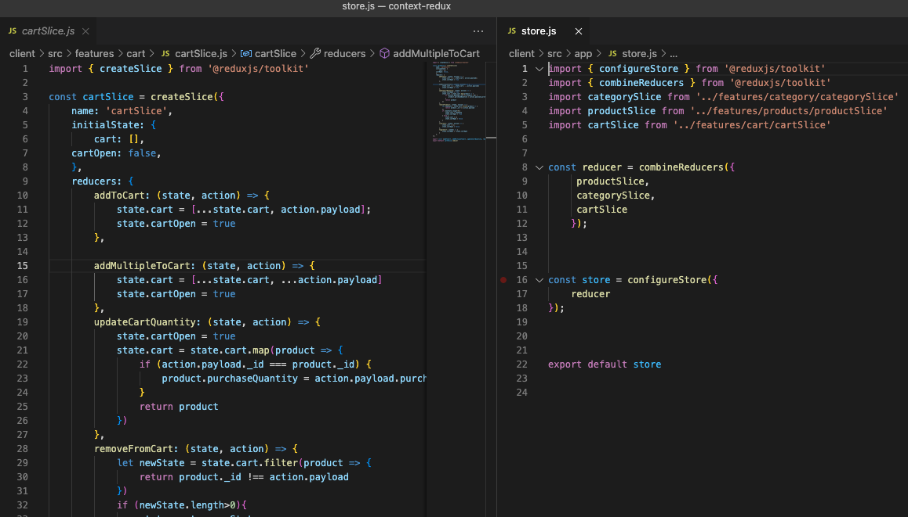

# context-redux

## Description 
A refactoring project taking a global store implemented with React Context API and replacing it with Redux

On the project learning: 
* How to implement Redux
* Comparing React Context API with Redux 

## Table of Contents
* [Installation](#installation)
* [Usage](#usage)
* [Built With](#built-with)
* [Questions](#questions)

## Installation
~~~
npm i
~~~
## Usage

Visit the project here: https://sleepy-dawn-82582.herokuapp.com/

Signup or Login with the following fake user:
> email: `eholt@testmail.com`
>
> password: `password12345`

## Built With
* MERN stack
* Redux-toolkit
* Initial Code: https://github.com/violanerd/shop-shop

## Questions

Contact me at madalyne@madalynecross.com with any questions. View more of my work here: [violanerd](https://github.com/violanerd).